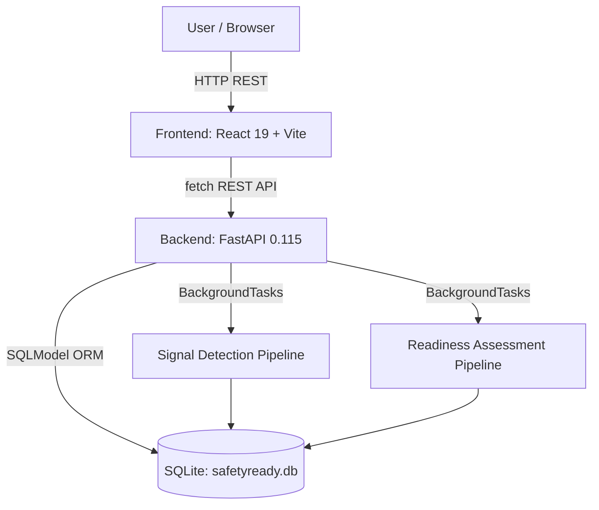

# SafetyReady — Technical Architecture

---

## System Architecture



No external services, message queues, or AI APIs are required.

---

## Components

| Component | Technology | Responsibility |
|---|---|---|
| Frontend | React 19, TypeScript, Vite 8 | SPA with hash-based routing; Upload → poll → results UI for both workflows |
| Backend API | FastAPI 0.115, Python 3.11+ | REST endpoints, request validation, background job dispatch |
| Signal Detection | Pure Python (in-process) | FAERS CSV/JSON ingestion → PRR computation → signal ranking |
| Readiness Assessment | Pure Python (in-process) | Dossier JSON/CSV parsing → CTD catalog mapping → gap generation → scoring |
| Database | SQLite via SQLModel / SQLAlchemy 2 | Single-file local store; all tables created on startup via `create_all` |
| Job runner | FastAPI `BackgroundTasks` | In-process async task queue; no Redis/Celery required |

---

## Data Flow: Signal Detection

```
POST /api/projects/{id}/signals/upload  (multipart CSV/JSON)
  │
  ├─ validate_schema()          check required columns (case_id, drug_raw, event_raw)
  ├─ save_upload()              persist file bytes to uploads/ dir + DB row
  ├─ create_job()               insert QUEUED job row
  └─ BackgroundTasks.add_task(run_signal_job)
       │
       ├─ ingest()              load → dedup → latest-version → clean → canonical records
       ├─ normalise_drug/event  alias dict + rapidfuzz fuzzy fallback
       ├─ build_event_clusters  group raw aliases by preferred MedDRA term
       ├─ build_contingency_tables  compute a/b/c/d for every (drug, event) pair
       ├─ apply_thresholds      PRR ≥ 2.0, a ≥ 3, (a+b) ≥ 5, (a+c) ≥ 3
       ├─ build_signal_results  filter to above/at threshold, assign rank + severity
       └─ persist signals       write Signal rows + mark job COMPLETE

GET /api/projects/{id}/signals          ranked signal list
GET /api/projects/{id}/signals/{id}     signal detail with a/b/c/d + PRR + CI
GET /api/projects/{id}/signals/clusters event cluster membership
GET /api/projects/{id}/signals/export   JSON or CSV download
```

## Data Flow: Submission Readiness Assessment

```
POST /api/projects/{id}/readiness/upload  (JSON or CSV dossier outline)
  │
  ├─ save_upload()              persist file bytes + DB row
  ├─ create_job()               insert QUEUED job row
  └─ BackgroundTasks.add_task(run_readiness_job)
       │
       ├─ parse_outline()       parse JSON/CSV → DossierSectionRecord[]
       ├─ build_catalog()       load 20-entry CTD requirements catalog (v0.1.0)
       ├─ map_requirements()    4-tier matching: exact code → normalised code
       │                        → keyword/title → fuzzy title (rapidfuzz ≥ 0.85)
       ├─ score_all_modules()   weighted score per CTD module (mandatory reqs only)
       ├─ score_overall()       mean of module scores (modules with mandatory reqs)
       ├─ generate_gaps()       GapRecord for every missing/review-needed requirement
       └─ persist assessment    ReadinessAssessment + RequirementMapping + Gap rows

GET /api/projects/{id}/readiness/summary       full assessment with scores + gaps
GET /api/projects/{id}/readiness/modules       per-module scores
GET /api/projects/{id}/readiness/requirements  mapping matrix with method + confidence
GET /api/projects/{id}/readiness/gaps          gap list with severity + filtering
PATCH /api/projects/{id}/readiness/gaps/{id}   update gap review status
GET /api/projects/{id}/readiness/export        JSON or Markdown download
```

---

## Database Schema

All tables are defined in `app/models/` and created via `SQLModel.metadata.create_all()`.

| Table | Purpose |
|---|---|
| `projects` | One row per project |
| `uploads` | File metadata; `storage_ref` points to `uploads/` directory |
| `jobs` | Background job lifecycle (queued → running → complete/failed) |
| `audit_events` | Immutable audit log of all state changes |
| `signals` | Persisted detection results with `result_json` blob |
| `reports`, `drugs`, `adverse_events`, `report_drugs`, `report_events`, `drug_event_pairs` | Signal domain normalisation tables |
| `ctd_requirements` | Versioned CTD catalog (seeded on demand) |
| `readiness_assessments` | Assessment result with `module_scores_json` blob |
| `dossier_sections` | Parsed dossier section records |
| `requirement_mappings` | One row per requirement per assessment; stores `mapping_method` + `confidence` |
| `gaps` | One row per gap; includes `severity`, `description`, `recommendation`, `review_status` |

---

## API Response Contract

All endpoints return one of two envelopes:

```json
{ "data": <T> }          // 2xx success
{ "error": { "code": "...", "message": "...", "field"?: "..." } }  // 4xx/5xx
```

TypeScript types mirror Python schemas exactly — see [`docs/contracts.md`](contracts.md).

---

## AI / LLM Usage

**None.** All computations are deterministic rule-based algorithms:

- PRR is computed via the standard pharmacovigilance formula: `PRR = [a/(a+b)] / [c/(c+d)]`
- Confidence intervals use the Evans (2001) log-normal approximation
- CTD mapping uses exact code, normalised code, keyword, and rapidfuzz fuzzy title matching
- Gap descriptions and recommendations are assembled from requirement metadata templates

No watsonx.ai, OpenAI, or other LLM calls are made. The application runs fully offline without any API key.

---

## Security Considerations

- No authentication layer (prototype; suitable for local/demo use only)
- No secrets committed to the repository; `.env` is in `.gitignore`
- `safetyready.db` is in `.gitignore` (added at column migration)
- `uploads/` directory is in `.gitignore`
- Upload validation (size limit 50 MB, content schema validation) before any DB write
- All error responses use a structured envelope — no raw stack traces exposed

---

## Known Technical Limitations

1. **No Alembic.** Schema evolution requires manual `ALTER TABLE` or deleting and recreating `safetyready.db`. Test suite always uses an isolated in-memory DB so tests are unaffected.
2. **SQLite only.** Suitable for prototype/demo; not for concurrent multi-user production.
3. **In-process job runner.** `FastAPI BackgroundTasks` runs in the same process as the web server. Long-running jobs block graceful shutdown. Production would use Celery + Redis or similar.
4. **File uploads stored on local disk** under `src/backend/uploads/`. Not suitable for multi-instance deployments.
5. **No authentication or authorisation.** All API endpoints are public.
6. **CTD catalog is illustrative.** The 20-entry prototype catalog covers representative requirements from all 5 ICH CTD modules; it is not a complete jurisdiction-specific regulatory checklist.
7. **Text/PDF dossier parsing is a stub.** `parse_text_outline()` returns an empty list. Only JSON and CSV dossier outlines are processed.
